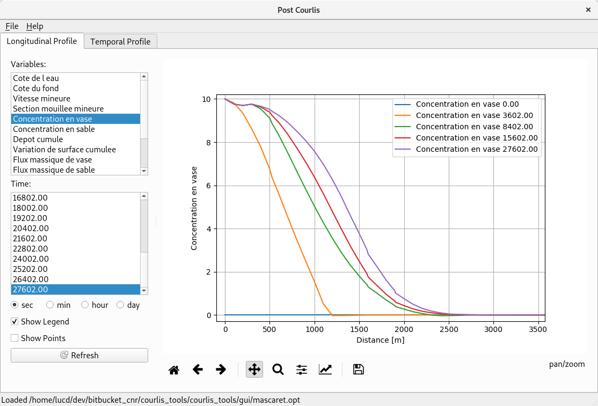
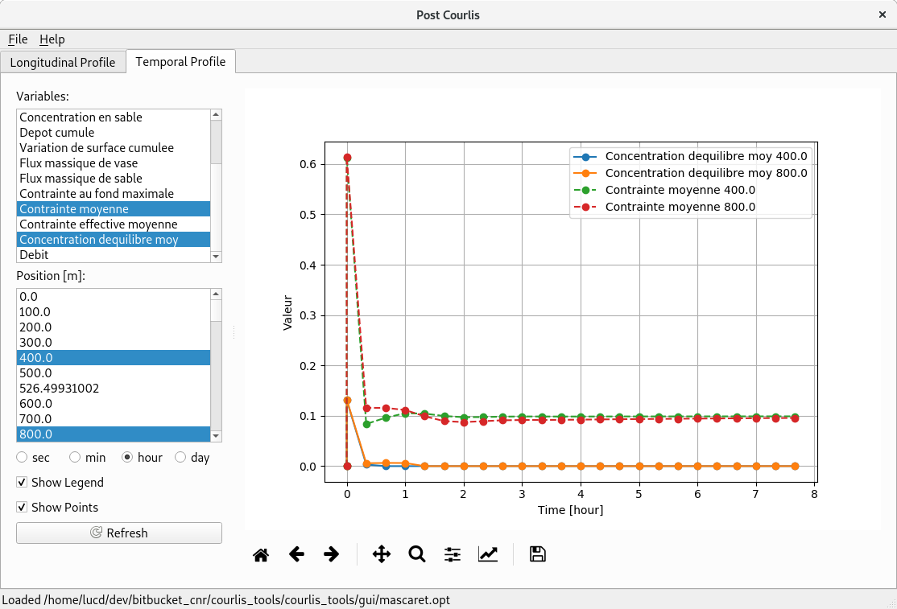

Courlis tools
=============

## PreCourlis

- **Read** `ST` and georef geometry files
- **Write** geometry files for Mascaret/Courlis
    - Mage/RubarBE (`ST`, no deposit description)
    - Courlis (`geo`, `georef`, `geoC`, `georefC`)
    - Shapefile (`POINTZ` with deposit description)
- **Export** tracks and limits to shp (`POLYLINEZ`)

### Convert geometry files
See `courlis_tools/examples/geom_converter/geom_example.py` file.

### Convert Courlis listing to Opthyca

```bash
python courlis_tools/cli/listing2opt.py courlis_tools/examples/results/result.listingcourlis result.opt
```

## PostCourlis

Read Opthyca (`opt`) and  `plong` result files and plot results on longitudinal or temporale profile on a GUI.

```bash
python courlis_tools/gui/postcourlis.py
```

The result file can be opened directly through an optional argument in specifing the file path:
```bash
python courlis_tools/gui/postcourlis.py courlis_tools/examples/results/result.opt
```

### Longitudinal Profile

Multiple variables and time series can be plotted.



### Temporal Profile

Multiple variables and cross-section positions can be plotted.


